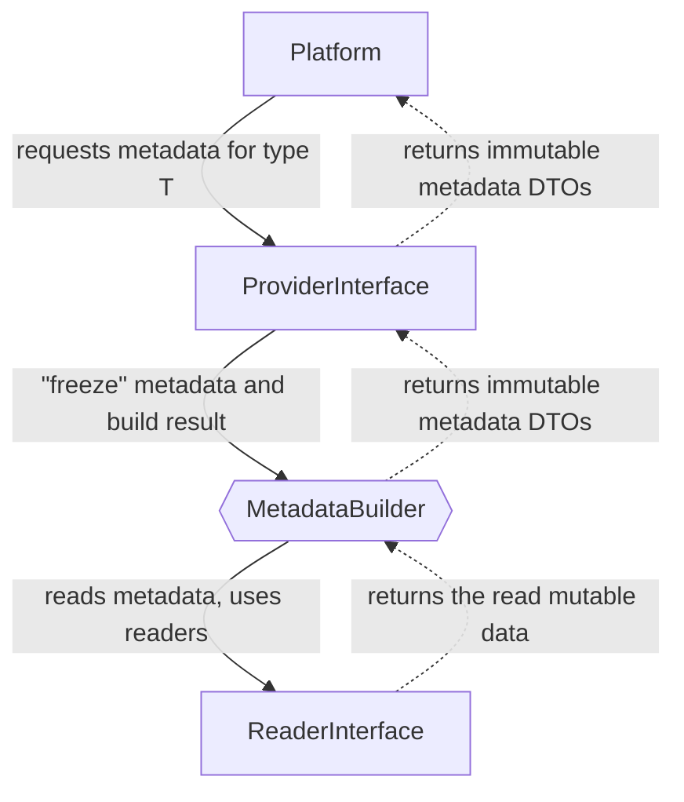

# Type Metadata

Type metadata is a DTO containing information about composite types, such as
objects, enums, etc., that can be used to supplement existing PHP code.

The metadata can be used directly in [type builders](type-builders.md) that 
require a description of the rules for
<tooltip term="normalize" xmlns="">normalization</tooltip> or 
<tooltip term="denormalize">denormalization</tooltip> such types (for example, 
objects of a certain class).

Thus, information about type metadata should be pass into the platform when 
necessary, for example:

```php
use TypeLang\Mapper\Mapper;
use TypeLang\Mapper\Platform\StandardPlatform;

$mapper = new Mapper(
    [[[platform: new StandardPlatform(|standard-platform.md]]]
        meta: $readerOrProvider,
        // ...
    ),
);
```

To obtain the metadata, two different categories of reading process
were implemented:
- [Metadata Reader](meta-reader.md) - Responsible for the process of reading and 
  supplementing metadata from various sources.
- [Metadata Provider](meta-provider.md) - Responsible for the process of "freezing" 
  (building) values onto immutable metadata DTOs and providing the user with
  the result of the work.

<tip>
You can read about readers in the 
<a href="meta-reader.md">&quot;metadata readers&quot; section</a>.
</tip>

<tip>
You can read about providers in the 
<a href="meta-provider.md">&quot;metadata providers&quot; section</a>.
</tip>

In general, the scheme for obtaining metadata looks like this:



In code, such a composition might look like this:

<snippet id="composition-example">
<code-block lang="PHP">
use TypeLang\Mapper\Mapper;
use TypeLang\Mapper\Mapping\Provider\InMemoryProvider;
use TypeLang\Mapper\Mapping\Provider\MetadataBuilder;
use TypeLang\Mapper\Mapping\Reader\NullReader;
use TypeLang\Mapper\Mapping\Reader\ReflectionReader;
use TypeLang\Mapper\Platform\StandardPlatform;

// An example of a composition from metadata readers
$reader = [[[new ReflectionReader(|meta-reader-reflection.md]]]
    delegate: [[[new NullReader()|meta-reader-null.md]]],
);

// Passing readers to the metadata builder
$provider = [[[new MetadataBuilder(|meta-provider.md]]]
    reader: $reader,
);

// An example of provider supplement
$provider = [[[new InMemoryProvider(|meta-provider-in-memory.md]]]
    delegate: $provider,
);

// Create mapper with a platform that supports metadata
$mapper = new Mapper([[[new StandardPlatform(|standard-platform.md]]]
    meta: $provider,
));
</code-block>
</snippet>

<tip>
You can find more information about metadata configuration rules 
in the <a href="meta-configuration.md">configuration section</a>.
</tip>