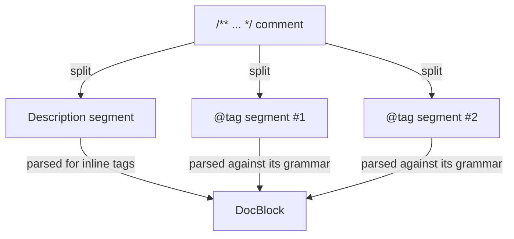

# PHPDoc Parser Component

<primary-label ref="phpdoc-component"/>
<show-structure for="chapter" depth="2"/>

Most PHP code carries part of its type information not in the signature
itself, but in the docblock above it — a `@param` narrowing an `array`
argument down to `list<User>`, a `@throws` PHP has no native syntax for at
all, a `@template` turning a plain class into a generic one. The PHPDoc
component reads that comment and turns it into a small, immutable object
graph: one entry per line, each already parsed according to what that
particular tag means.

Every type a tag carries — a `@param`'s argument type, a `@return`'s result,
a `@template`'s bound — is parsed with the very same
[TypeLang grammar](introduction.md) used everywhere else in this project.
A type written inside a docblock is therefore described exactly as precisely
as one written directly in PHP code; nothing is lost by moving it into a
comment.

## Installation

<tldr>
    <p>
        Via <a href="https://getcomposer.org/doc/01-basic-usage.md#installing-dependencies">Composer</a>:
        <code lang="bash">composer require type-lang/phpdoc</code>
    </p>
</tldr>

**Requirements:**
* `PHP >= 8.4`
* `ext-mbstring` <sup>optional</sup>

<note>
Every tag this component understands — including the generic
(<code>@template</code>) and structural (<code>@param</code>,
<code>@property</code>, ...) families — ships in this single package.
Earlier releases split those out into separate
<code>type-lang/phpdoc-standard-tags</code> and
<code>type-lang/phpdoc-template-tags</code> extensions; both have since been
folded back in, and installing <code>type-lang/phpdoc</code> alone is
enough.
</note>

## Usage

Parsing a comment is a single call: hand `DocBlockParser::parse()` the raw
`/** ... */` text, and it hands back a `DocBlock`.

```php
use TypeLang\PhpDoc\DocBlockParser;

$parser = new DocBlockParser();

$block = $parser->parse(<<<'PHPDOC'
    /**
     * Sends a notification to the given recipient.
     *
     * @see Mailer::send() The underlying transport.
     * @link https://example.com/docs Delivery documentation.
     * @return bool
     */
    PHPDOC);
```

The description — everything written before the first tag — is available as
`$block->description`, and the tags themselves form an ordered, countable,
iterable collection:

```php
echo $block->description;
// "Sends a notification to the given recipient."

echo count($block); // 3

foreach ($block as $tag) {
    echo $tag->name; // "see", "link", "return"
}

$see = $block[0]; // SeeTag
echo $see->reference; // "Mailer::send()"
```

A single malformed tag never brings the rest of the comment down with it.
A tag whose name isn't recognized, or whose body doesn't match the grammar
expected for its name, is not thrown as an exception — it is returned as an
`InvalidTag`, carrying the failure reason alongside it, so that the other,
well-formed tags around it are still parsed normally:

```php
$block = $parser->parse(<<<'PHPDOC'
    /**
     * @param int $wellFormed
     * @param not a valid type here $because
     */
    PHPDOC);

$broken = $block[1]; // object(InvalidTag)

echo $broken->name; // "param"

// Malformed "@param" tag, expected:
// <Type> <Variable> [ <Description> ]
echo $broken->reason->getMessage();
```

<tip>
A <code>DocBlockParser</code> instance builds its internal tag and type
grammar once, in its constructor, and is otherwise stateless. Construct it
once and reuse (or share) it across an entire application, rather than
building a new instance per docblock.
</tip>

## How a Comment Is Read

Parsing happens in two passes that mirror the two logical parts of a
comment: first the whole text is split into the leading description and one
segment per tag line, and only then is each of those segments parsed on its
own — the description checked for inline tags, each tag line checked against
the grammar declared for its name.



### DocBlock

A `DocBlock` is a read-only snapshot of the whole comment: an optional
`description` and the ordered `tags` list. It additionally behaves as a
collection of its own tags — countable, iterable, and indexable by integer
offset — so `count($block)`, `foreach ($block as $tag)` and `$block[0]` all
work directly on it without reaching for `->tags` explicitly.

### Description

Everything before the first tag becomes the description. Most of the time
that is just text, represented by a plain `Description` object exposing a
single `$value` string. When the text additionally contains one or more
**inline tags** — a `{@tag ...}` sequence with balanced braces, such as
`{@see Mailer::send()}` written in the middle of a sentence — it is
represented as a `TaggedDescription` instead: an ordered mix of plain-text
fragments and the nested tags found among them.

```
/**
 * Hello world {@see Mailer::send()} and more text after it.
   └────┬────┘ └─────────┬─────────┘ └──────────┬──────────┘
      text            nested tag              text
 */
```

Only a handful of tags — [@see](see-tag.md), [@link](link-tag.md),
[@internal](internal-tag.md), [@inheritdoc](inheritdoc-tag.md),
[@example](example-tag.md) and [@source](source-tag.md) — are ever recognized
this way. Whether a tag may be lifted out of running text is declared by its
[placement](definitions.md#inline-tags); a `{@param}`, for instance, is never
lifted out: `@param` is a block-only tag, so the braces around it stay exactly
as written, as plain text.

### Tag

Every tag, whether it stood on its own line or was found nested inside a
description, carries at minimum a `$name` (without the leading `@`) and an
optional `$description` (whatever text follows its own body). A tag
recognized by name exposes further, tag-specific parts on top of that — a
`ParamTag` additionally exposes the argument's `$type` and `$variable`, a
`SeeTag` exposes what it `$reference`s, and so on. A tag whose name has no
registered definition at all — including every tag still marked "Not Implemented" 
in the sidebar — falls back to a plain `Tag`, with its entire suffix folded 
unparsed into the description.

## Where to Go Next

Every tag this component recognizes has its own page in the sidebar,
grouped by where it comes from: Standard, Advanced, phpDocumentor, or a
specific static analyzer (Psalm, PHPStan, Phan, PhpStorm, PHP
CodeSniffer) for the ones not yet implemented.

<deflist>
    <def title="Extending">
        How a tag's own grammar is declared, how to add a tag of your own,
        and how to write a new grammar building block (a "combinator") for
        one. See <a href="custom-tags.md">Extending</a>.
    </def>
</deflist>
